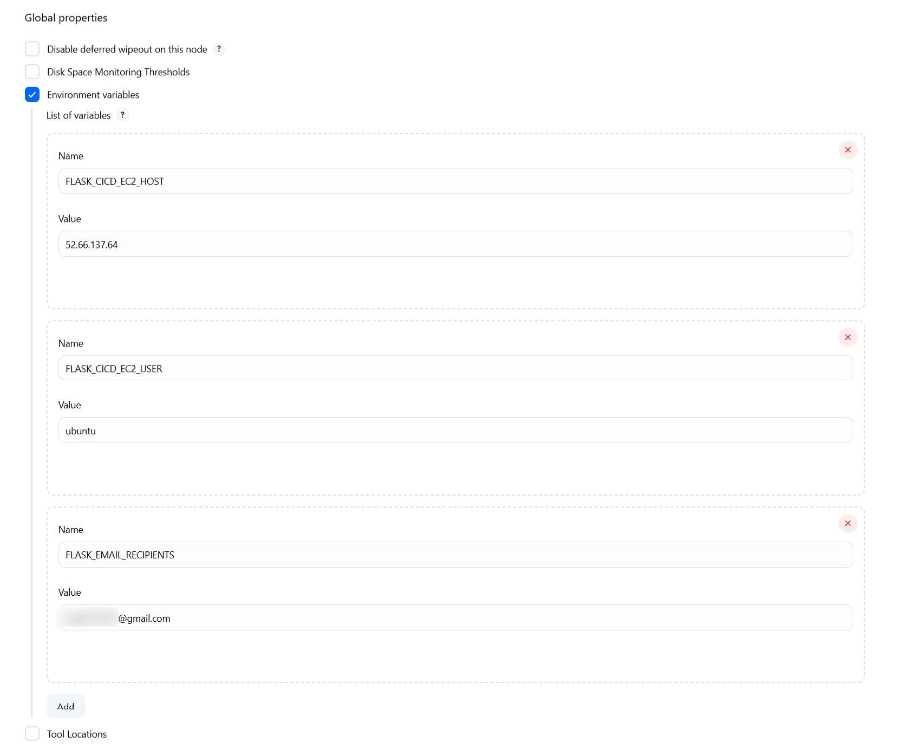

# Jenkins Global Environment Variables

This document outlines the global environment variables configured in Jenkins.

## Global Properties Configuration

1. Navigate to your Jenkins **Dashboard**.
2. Click **Manage Jenkins**.
3. Select **System**.
4. Scroll down to **Global properties**.
5. Fill out the fields as follows:

- ✅ **Environment variables** are enabled.

### List of Environment Variables

| Name                    | Value               | Description                        |
|-------------------------|---------------------|------------------------------------|
| `FLASK_CICD_EC2_HOST`   | `52.66.137.64`      | Public IP of the EC2 instance      |
| `FLASK_CICD_EC2_USER`   | `ubuntu`            | Default SSH user for EC2 login     |
| `FLASK_EMAIL_RECIPIENTS`| `xxxxxxx@gmail.com` | Email recipient for notifications  |