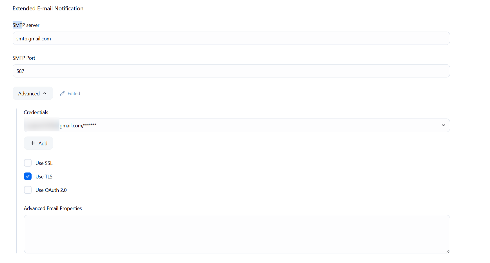

# Jenkins Extended E-mail Notification Configuration

This configuration enables Jenkins to send e-mails using Gmail SMTP.

1. Navigate to your Jenkins **Dashboard**.
2. Click **Manage Jenkins**.
3. Select **System**.
4. Scroll down to **Extended E-mail Notification**.
5. Fill out the fields as follows:

## SMTP Settings

| Setting      | Value               |
|--------------|---------------------|
| SMTP Server  | `smtp.gmail.com`    |
| SMTP Port    | `587`               |

## Advanced Settings

- **Credentials**: Set to a Gmail-based user with an app-specific password or a valid credential ID in Jenkins.
- **Use TLS**: ✅ *(Enabled)*

## Notes

- Ensure **TLS** is enabled for Gmail SMTP on port `587`.
- If you're using Gmail, you must either:
  - Generate and use an **App Password** (if 2FA is enabled).
- It’s recommended to test the configuration after setting up to ensure delivery works.
